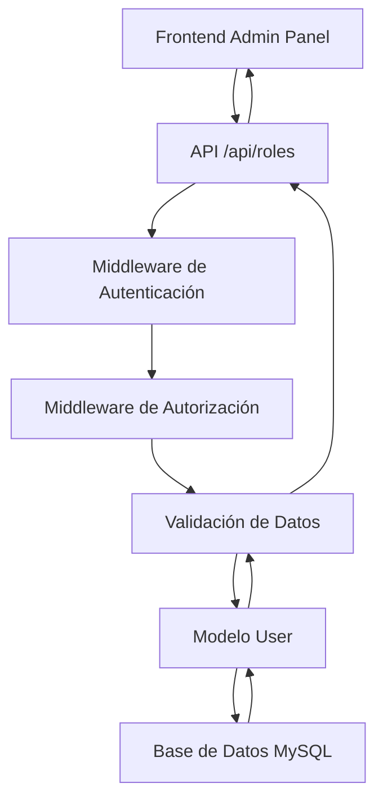

# Sistema CRUD de Roles - Documentación Completa

## 📋 **Resumen del Sistema**

Se ha implementado un sistema CRUD (Create, Read, Update, Delete) completo para la gestión de roles de usuarios en la aplicación de lenguaje de señas. Este sistema permite a los administradores gestionar usuarios de manera eficiente y funcional.

## 🏗️ **Arquitectura del Sistema**

### **Backend (API REST)**
- **Archivo**: `routes/roles.js`
- **Base URL**: `/api/roles`
- **Autenticación**: JWT Token requerido
- **Autorización**: Solo administradores

### **Frontend (Panel de Administración)**
- **Archivo**: `public/js/admin.js`
- **Vista**: `public/views/admin.html`
- **Estilos**: `public/css/admin.css`

### **Modelo de Datos**
- **Archivo**: `models/User.js`
- **Base de datos**: MySQL
- **Tabla**: `users`

## 🔧 **Operaciones CRUD Implementadas**

### **1. CREATE (Crear)**
```javascript
POST /api/roles/create-user
```

**Parámetros requeridos:**
- `name`: Nombre del usuario (2-100 caracteres)
- `email`: Email válido y único
- `password`: Contraseña (mínimo 6 caracteres)
- `role`: Rol del usuario (`admin`, `profesor`, `estudiante`, `padre`)
- `parent_id`: ID del padre (opcional, solo para estudiantes)

**Ejemplo de uso:**
```javascript
const userData = {
    name: "Juan Pérez",
    email: "juan@example.com",
    password: "password123",
    role: "profesor"
};

await adminPanel.createUserWithRole(userData);
```

### **2. READ (Leer)**

#### **Obtener todos los usuarios:**
```javascript
GET /api/roles/all
```

#### **Obtener usuarios por rol:**
```javascript
GET /api/roles/by-role/{role}
```

#### **Obtener estadísticas:**
```javascript
GET /api/roles/stats
```

**Ejemplo de uso:**
```javascript
// Obtener todos los usuarios
const users = await adminPanel.loadUsers();

// Obtener solo profesores
const profesores = await adminPanel.getUsersByRole('profesor');

// Obtener estadísticas
const stats = await adminPanel.getRoleStats();
```

### **3. UPDATE (Actualizar)**
```javascript
PUT /api/roles/update/{userId}
```

**Parámetros:**
- `role`: Nuevo rol del usuario
- `parent_id`: Nuevo padre asignado (opcional)

**Ejemplo de uso:**
```javascript
// Cambiar rol de usuario
await adminPanel.saveUserChanges();
```

### **4. DELETE (Eliminar)**
```javascript
DELETE /api/roles/delete/{userId}
```

**Restricciones:**
- No se pueden eliminar administradores
- Confirmación requerida antes de eliminar

**Ejemplo de uso:**
```javascript
await adminPanel.deleteUser(userId);
```

## 🎯 **Funcionalidades del Frontend**

### **Modal de Creación de Usuario**
- Formulario completo con validación
- Selector de rol dinámico
- Selector de padre (solo para estudiantes)
- Validación en tiempo real

### **Modal de Edición de Usuario**
- Edición rápida de roles
- Asignación de padres
- Validación de permisos

### **Tabla de Usuarios**
- Lista completa de usuarios
- Filtros por rol
- Búsqueda por nombre/email
- Acciones rápidas (Editar/Eliminar)

### **Estadísticas en Tiempo Real**
- Contador de usuarios por rol
- Relaciones padre-estudiante
- Actualización automática

## 🔐 **Seguridad y Validaciones**

### **Backend**
- ✅ Autenticación JWT requerida
- ✅ Solo administradores pueden acceder
- ✅ Validación de datos con `express-validator`
- ✅ Protección contra eliminación del último admin
- ✅ Validación de relaciones padre-estudiante

### **Frontend**
- ✅ Validación de formularios
- ✅ Confirmación antes de eliminar
- ✅ Manejo de errores con mensajes claros
- ✅ Prevención de envíos duplicados

## 📊 **Estructura de Respuestas de la API**

### **Respuesta Exitosa:**
```json
{
    "success": true,
    "message": "Operación exitosa",
    "data": {
        "user": {
            "id": 1,
            "name": "Juan Pérez",
            "email": "juan@example.com",
            "role": "profesor",
            "parent_id": null,
            "created_at": "2024-01-01T00:00:00.000Z",
            "updated_at": "2024-01-01T00:00:00.000Z"
        }
    }
}
```

### **Respuesta de Error:**
```json
{
    "success": false,
    "message": "Descripción del error",
    "errors": [
        {
            "param": "email",
            "msg": "Email inválido"
        }
    ]
}
```

## 🚀 **Cómo Usar el Sistema**

### **1. Acceder al Panel de Administración**
1. Iniciar sesión como administrador
2. Hacer clic en "Panel de Administración" en el dashboard
3. Navegar a la sección "Usuarios"

### **2. Crear un Nuevo Usuario**
1. Hacer clic en "Crear Usuario"
2. Llenar el formulario con los datos requeridos
3. Seleccionar el rol apropiado
4. Si es estudiante, asignar un padre
5. Hacer clic en "Crear Usuario"

### **3. Editar un Usuario Existente**
1. Hacer clic en "Editar" en la fila del usuario
2. Cambiar el rol en el modal
3. Si es estudiante, asignar/cambiar padre
4. Hacer clic en "Cambiar Rol"

### **4. Eliminar un Usuario**
1. Hacer clic en "Eliminar" en la fila del usuario
2. Confirmar la eliminación
3. El usuario será eliminado permanentemente

## 🔄 **Flujo de Datos**



## 📈 **Beneficios del Sistema**

### **Para Administradores:**
- ✅ Gestión completa de usuarios
- ✅ Asignación rápida de roles
- ✅ Control de relaciones padre-estudiante
- ✅ Estadísticas en tiempo real
- ✅ Interfaz intuitiva y funcional

### **Para el Sistema:**
- ✅ Seguridad robusta
- ✅ Validaciones completas
- ✅ Manejo de errores
- ✅ Escalabilidad
- ✅ Mantenibilidad

## 🛠️ **Tecnologías Utilizadas**

### **Backend:**
- Node.js + Express.js
- MySQL2 (Base de datos)
- JWT (Autenticación)
- express-validator (Validación)
- bcryptjs (Encriptación)

### **Frontend:**
- JavaScript Vanilla
- HTML5 + CSS3
- Font Awesome (Iconos)
- Chart.js (Gráficos)

## 📝 **Próximas Mejoras Sugeridas**

1. **Paginación**: Para manejar grandes cantidades de usuarios
2. **Exportación**: Exportar listas de usuarios a CSV/Excel
3. **Historial**: Log de cambios de roles
4. **Notificaciones**: Alertas por email al cambiar roles
5. **Bulk Operations**: Operaciones masivas en usuarios

## 🎉 **Conclusión**

El sistema CRUD de roles está completamente implementado y funcional. Proporciona una interfaz intuitiva para la gestión de usuarios con todas las operaciones necesarias: crear, leer, actualizar y eliminar usuarios con diferentes roles. El sistema es seguro, escalable y fácil de mantener.

---

**Fecha de implementación**: Enero 2024  
**Versión**: 1.0  
**Estado**: ✅ Completado y Funcional
